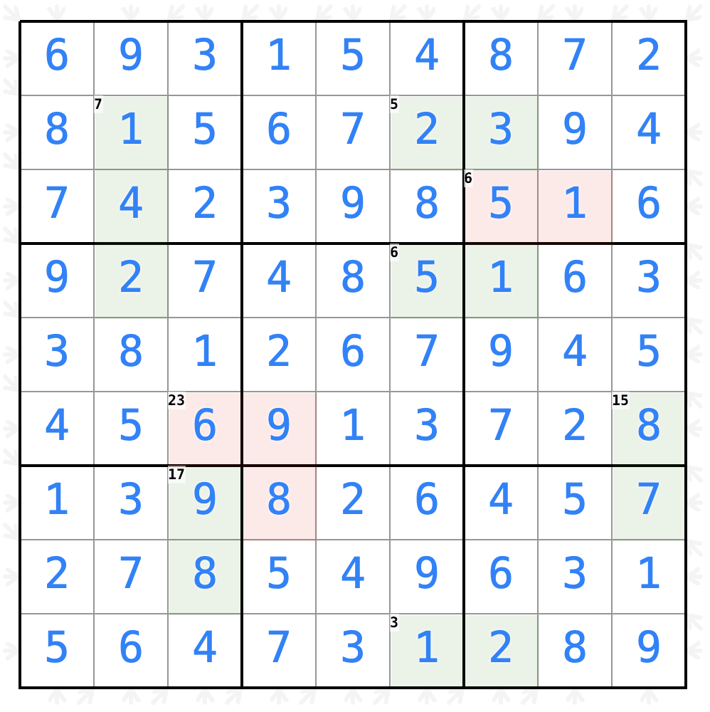
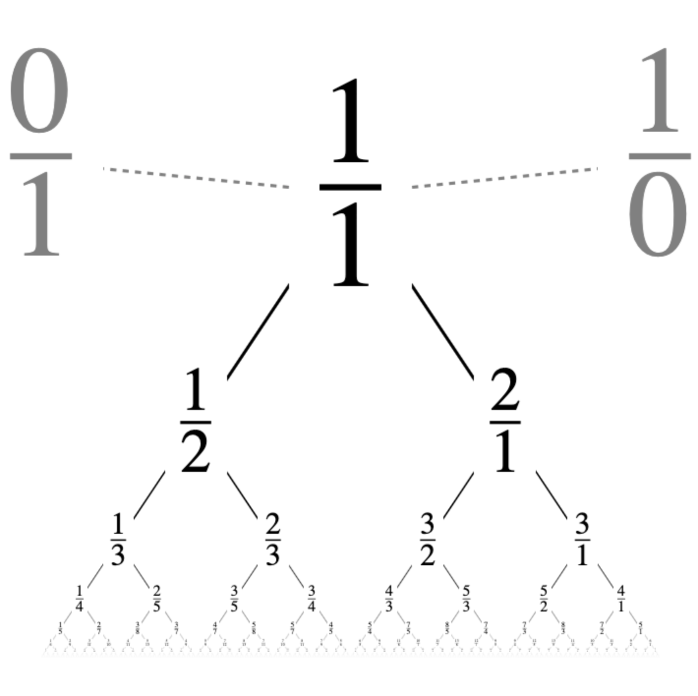
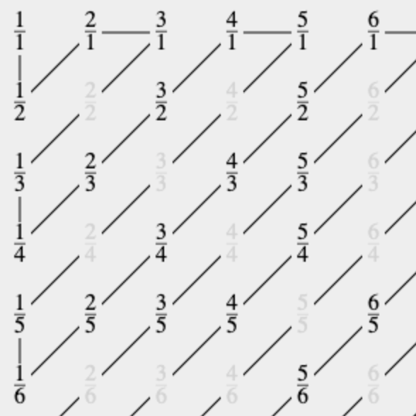
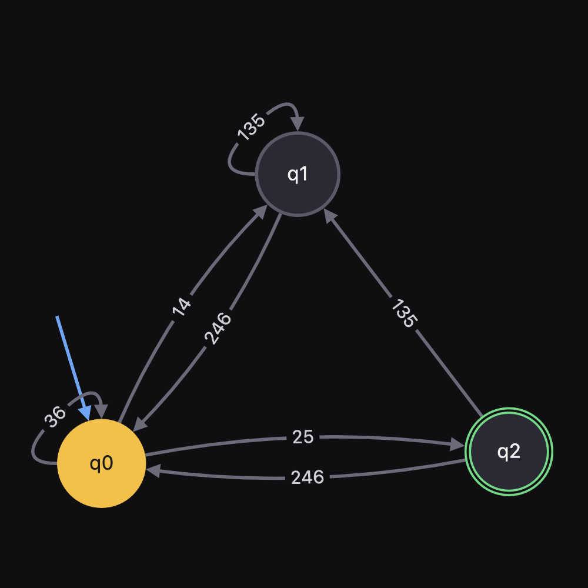
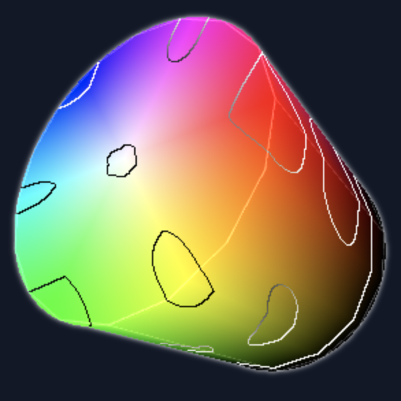

## [Interactive Sudoku Solver](https://sigh.github.io/Interactive-Sudoku-Solver)

A fast interactive Sudoku solver written in Javascript.
Handles many Sudoku variants including Killer Sudoku and Jigsaw Sudoku.

## [Stern-Brocot Tree](https://sigh.github.io/Stern-Brocot-Tree/)

An infinitly\* zoomable
[Stern-Brocot Tree](https://en.wikipedia.org/wiki/Stern%E2%80%93Brocot_tree).
This structure contains all positive rational numbers in their lowest form,
and in order.

## [Enumerating the Rationals with Stern-Brocot Trees](https://sigh.github.io/Stern-Brocot-Tree/enumerate)

An article showing how to define a simple, efficient enumeration of the rational
numbers.

## [NFA Visualizer](https://sigh.github.io/NFA-Visualizer)

Generate Non-deterministic Finite Automata (NFA) programmatically, visualize
how they are optimized and simulate them on input strings.

## [Reed-Solomon Error Correction](https://sigh.github.io/reed-solomon)

An interactive demo of
[Reed-Solomon](https://en.wikipedia.org/wiki/Reed%E2%80%93Solomon_error_correction)
error correction.
It also explains the algorithm at a high level assuming knowledge of polynomial
arithmetic and solving linear equations.

## [L-System Visualization](https://sigh.github.io/L-System)

[L-systems](https://en.wikipedia.org/wiki/L-system) are parallel rewriting
systems commonly used to generate fractals and other complex geometric patterns.
They work by repeatedly applying simple transformation rules to an initial
string of symbols, producing intricate self-similar structures.

## [Color Space Explorer](https://sigh.github.io/Color-Space-Explorer)

An interactive 3D visualization tool for exploring different color spaces (RGB,
HSV, HSL). Navigate through color spaces in both 2D slices and 3D volumes,
with support for different distance metrics.

## [Puzzles](https://sigh.github.io/puzzles)

Collection of logic and math puzzles.
